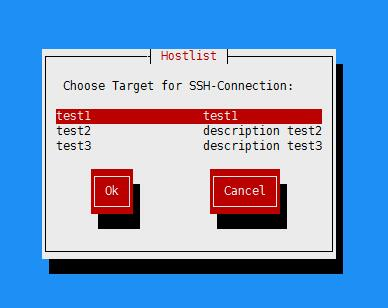

# jump_menu

python 跳转机菜单

<!-- vim-markdown-toc GFM -->
* [安装及使用](#安装及使用)
* [其他相关项目](#其他相关项目)
* [版本发布](#版本发布)
* [参加步骤](#参加步骤)
* [小额捐款](#小额捐款)

<!-- vim-markdown-toc -->

## 安装及使用

[使用手册](docs/install.md)



## 其他相关项目

> * 批量运维工具 xbatch---------------------------------------------[xbatch](https://github.com/BillWang139967/xbatch)

## 版本发布

* v1.0.2，2017-03-28，更新：添加 snack.py 文件，兼容 ubuntu 系统
* v1.0.1，2018-08-31，新增：发布初始版本。


## 参加步骤

* 在 GitHub 上 `fork` 到自己的仓库，然后 `clone` 到本地，并设置用户信息。
```
$ git clone https://github.com/BillWang139967/jump_menu.git
$ cd jump_menu
$ git config user.name "yourname"
$ git config user.email "your email"
```
* 修改代码后提交，并推送到自己的仓库。
```
$ #do some change on the content
$ git commit -am "Fix issue #1: change helo to hello"
$ git push
```
* 在 GitHub 网站上提交 pull request。
* 定期使用项目仓库内容更新自己仓库内容。
```
$ git remote add upstream https://github.com/BillWang139967/jump_menu.git
$ git fetch upstream
$ git checkout master
$ git rebase upstream/master
$ git push -f origin master
```

## 小额捐款

如果你觉得 jump_menu 对你有帮助，可以对作者进行小额捐款（支付宝）


